# UDM 3GPP Procedure Flows — Sequence Diagrams

| Document Property | Value |
|-------------------|-------|
| **Version** | 1.0.0 |
| **Status** | Draft |
| **Classification** | Internal — Engineering |
| **Last Updated** | 2025 |
| **Parent Document** | [architecture.md](architecture.md) |

---

## Table of Contents

1. [Introduction](#1-introduction)
2. [5G UE Registration Flow](#2-5g-ue-registration-flow)
3. [5G-AKA Authentication Flow](#3-5g-aka-authentication-flow)
4. [EAP-AKA' Authentication Flow](#4-eap-aka-authentication-flow)
5. [SUCI Deconceal Flow](#5-suci-deconceal-flow)
6. [PDU Session Establishment](#6-pdu-session-establishment)
7. [UE Deregistration Flow](#7-ue-deregistration-flow)
8. [Subscription Data Update Notification Flow](#8-subscription-data-update-notification-flow)
9. [SMS Registration Flow](#9-sms-registration-flow)
10. [Event Exposure Subscription Flow](#10-event-exposure-subscription-flow)
11. [Roaming Scenario](#11-roaming-scenario)
12. [Network Slicing Data Retrieval](#12-network-slicing-data-retrieval)
13. [State Machine Diagrams](#13-state-machine-diagrams)
14. [Common Error Handling](#14-common-error-handling)

---

## 1. Introduction

### 1.1 Purpose

This document provides detailed sequence diagrams for every major 3GPP procedure flow that involves the UDM. Each diagram maps directly to the Nudm service operations defined in **TS 29.503** and the system procedures in **TS 23.502**.

### 1.2 Scope

The diagrams cover all 11 Nudm service APIs and their interactions with external NFs (AMF, AUSF, SMF, SMSF, NRF, PCF, NEF). Because the UDM consolidates the UDR role internally, all subscription-data access is shown as direct YugabyteDB queries rather than Nudr API calls.

### 1.3 Conventions

- **Solid arrows** (`->>`) represent synchronous HTTP/2 requests.
- **Dashed arrows** (`-->>`) represent asynchronous responses or callbacks.
- **`YugabyteDB`** participant represents the internal database — no separate UDR NF exists.
- All HTTP methods and paths reference the OpenAPI specs in `docs/3gpp/TS29503_Nudm_*.yaml`.
- Mermaid `sequenceDiagram` syntax is used throughout.

---

## 2. 5G UE Registration Flow

### 2.1 Description

The initial registration procedure is the first interaction the UDM sees for a given UE. After the AMF authenticates the UE (via AUSF/UDM), the AMF registers its serving context with the UDM and retrieves the subscriber's access and mobility data.

**3GPP Reference**: TS 23.502 Section 4.2.2.2, TS 29.503 (Nudm_UECM, Nudm_SDM)

### 2.2 Sequence Diagram

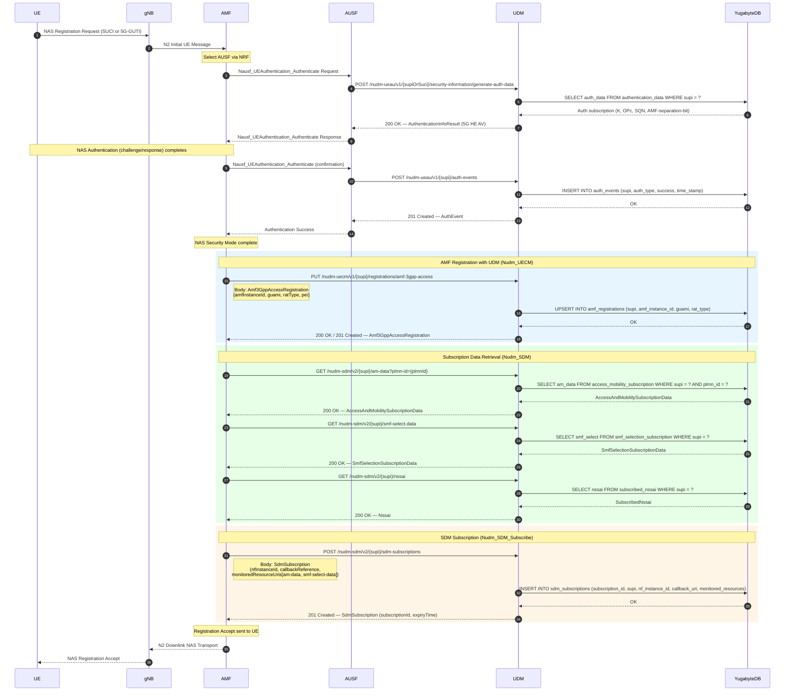

### 2.3 UDM Internal Processing Notes

- **AMF Registration**: The UDM checks for an existing AMF registration. If a different AMF was previously registered, the UDM sends a deregistration notification to the old AMF before overwriting.
- **DB Queries**: AMF registration uses an `UPSERT` to atomically replace any prior context. The `amf_registrations` table is keyed by `(supi, access_type)`.
- **SDM Subscription**: The UDM generates a unique `subscriptionId` and stores the callback URI for future change notifications.

### 2.4 Error Handling

| Step | Error Condition | UDM Behaviour |
|------|----------------|---------------|
| AMF Registration | SUPI not found | 404 Not Found — `SUBSCRIPTION_NOT_FOUND` |
| AMF Registration | Duplicate context collision | Notify old AMF via Namf_Communication callback, then overwrite |
| SDM Get | Missing data set | 404 Not Found per data-set; partial success still returns 200 for available sets |
| SDM Subscribe | Invalid callback URI | 400 Bad Request — `INVALID_CALLBACK_URI` |

---

## 3. 5G-AKA Authentication Flow

### 3.1 Description

The primary authentication method for 5G. The AUSF requests authentication vectors from the UDM, which generates the 5G Home Environment Authentication Vector (5G HE AV). The UDM resolves SUCI to SUPI if needed and returns RAND, AUTN, XRES*, and Kausf.

**3GPP Reference**: TS 33.501 Section 6.1.3, TS 29.503 (Nudm_UEAU)

### 3.2 Sequence Diagram

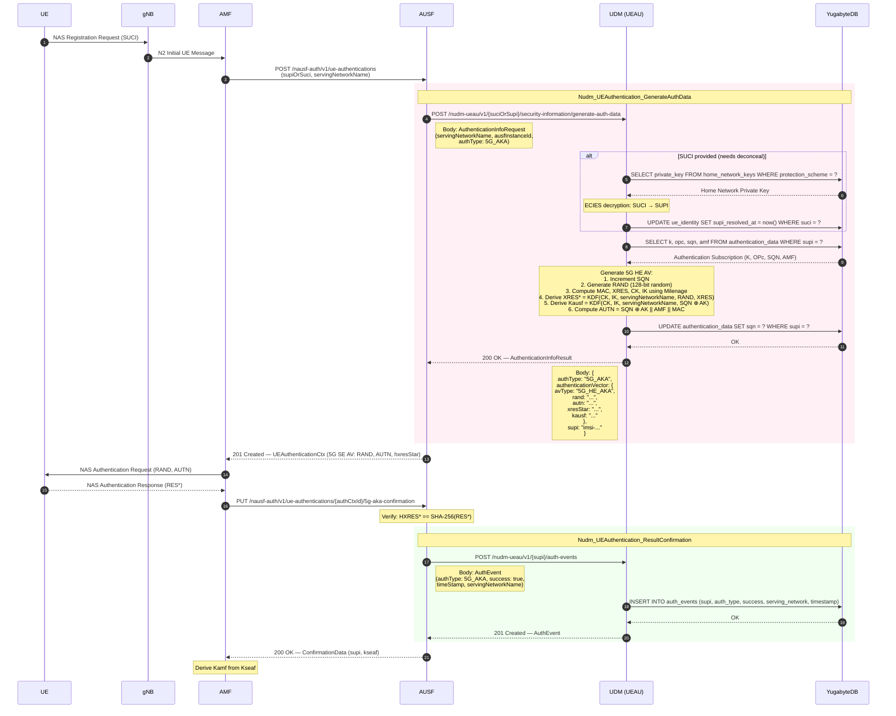

### 3.3 UDM Internal Processing Notes

- **SQN Management**: The sequence number is incremented atomically per authentication. YugabyteDB's distributed transactions ensure no SQN reuse across regions.
- **Key Derivation**: All KDFs follow NIST SP 800-108 (HMAC-based) as specified by 3GPP TS 33.501 Annex A.
- **Auth Vector Caching**: No caching of authentication vectors; each request generates a fresh AV to prevent replay.

### 3.4 Error Handling

| Step | Error Condition | UDM Behaviour |
|------|----------------|---------------|
| SUCI Resolution | Unknown SUCI scheme | 403 Forbidden — `UNSUPPORTED_PROTECTION_SCHEME` |
| Auth Data Lookup | SUPI not provisioned | 404 Not Found — `USER_NOT_FOUND` |
| SQN Sync | SQN out of range (AUTS received) | Resync SQN from AUTS, return new AV |
| Generate AV | Internal crypto failure | 500 Internal Server Error |

---

## 4. EAP-AKA' Authentication Flow

### 4.1 Description

EAP-AKA' is the alternative primary authentication method for 5G, using the Extensible Authentication Protocol framework. The UDM generates an EAP-AKA' authentication vector (CK', IK' derived per RFC 5448) instead of the 5G-AKA vector.

**3GPP Reference**: TS 33.501 Section 6.1.3.1, RFC 5448, TS 29.503 (Nudm_UEAU)

### 4.2 Sequence Diagram

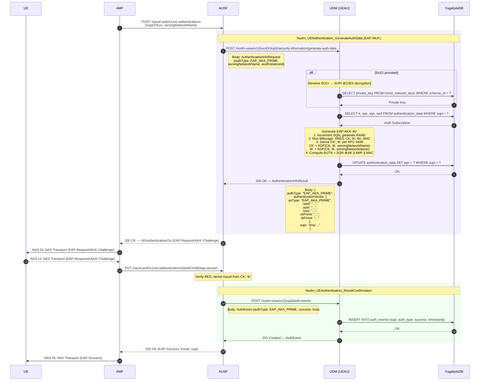

### 4.3 UDM Internal Processing Notes

- **Key Difference from 5G-AKA**: The UDM returns `CK'` and `IK'` (derived per RFC 5448) rather than `XRES*` and `Kausf`. The AUSF derives Kausf locally.
- **AMF Separation Bit**: The AMF field in AUTN has bit 0 set to 1 for EAP-AKA' to distinguish from legacy EAP-AKA.
- **DB Access Pattern**: Identical to 5G-AKA — same `authentication_data` table, same SQN update.

### 4.4 Error Handling

| Step | Error Condition | UDM Behaviour |
|------|----------------|---------------|
| Auth Type Selection | UE subscription does not allow EAP-AKA' | 403 Forbidden — `AUTH_TYPE_NOT_SUPPORTED` |
| SQN Sync Failure | AUTS received from UE | Process re-sync; return new AV with corrected SQN |

---

## 5. SUCI Deconceal Flow

### 5.1 Description

SUCI (Subscription Concealed Identifier) deconceal is a standalone service that decrypts the SUCI to recover the SUPI. This uses the home network's ECIES private key corresponding to the public key the UE used during concealment.

**3GPP Reference**: TS 29.503 (Nudm_UEID), TS 33.501 Section 6.12

### 5.2 Sequence Diagram

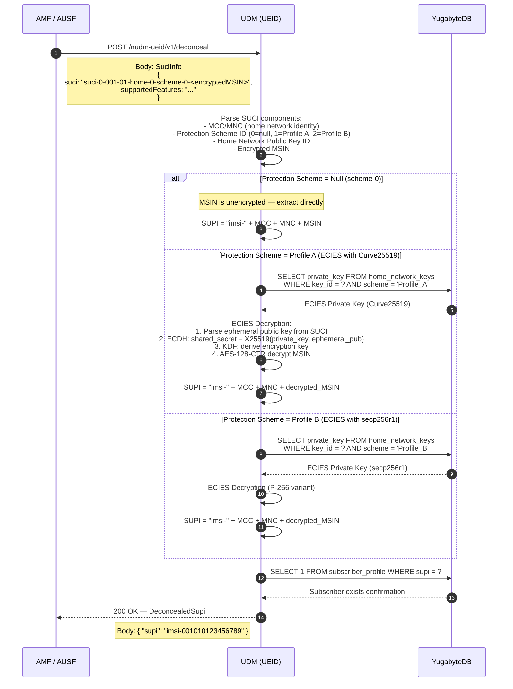

### 5.3 UDM Internal Processing Notes

- **Key Storage**: Home network private keys are stored encrypted at rest in YugabyteDB with envelope encryption. The UDM decrypts them in memory using a KMS-managed key.
- **Performance**: SUCI deconceal is on the critical path for every initial registration. The private keys are cached in-process after first load to avoid repeated DB lookups.
- **Null Scheme**: When protection scheme 0 is used, no decryption is needed — the MSIN is sent in cleartext. This is mainly for testing.

### 5.4 Error Handling

| Step | Error Condition | UDM Behaviour |
|------|----------------|---------------|
| SUCI Parsing | Malformed SUCI string | 400 Bad Request — `INVALID_SUCI_FORMAT` |
| Key Lookup | Unknown key ID | 403 Forbidden — `HOME_NETWORK_KEY_NOT_FOUND` |
| Decryption | Decryption failure (tampered data) | 403 Forbidden — `DECONCEAL_FAILED` |
| Subscriber Check | SUPI not provisioned | 404 Not Found — `USER_NOT_FOUND` |

---

## 6. PDU Session Establishment

### 6.1 Description

During PDU Session Establishment, the SMF interacts with the UDM to register its serving context and retrieve session management subscription data. The data is per-DNN and per-S-NSSAI.

**3GPP Reference**: TS 23.502 Section 4.3.2, TS 29.503 (Nudm_UECM, Nudm_SDM)

### 6.2 Sequence Diagram

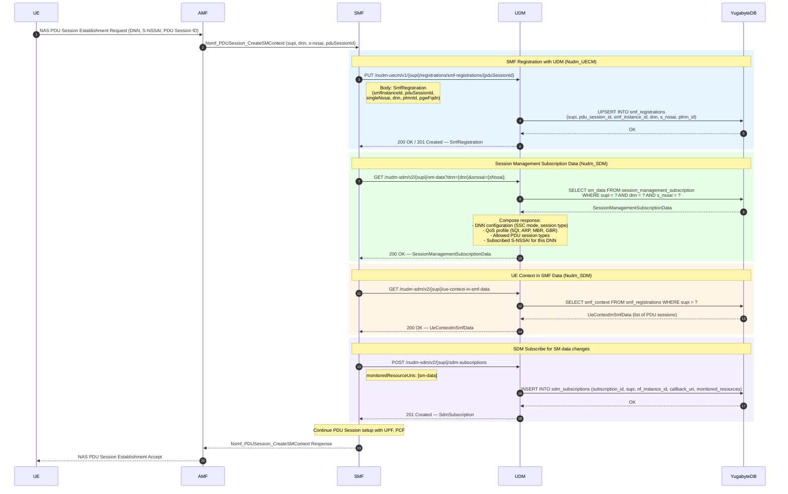

### 6.3 UDM Internal Processing Notes

- **Per-DNN, Per-S-NSSAI Filtering**: The `session_management_subscription` table is indexed by `(supi, dnn, s_nssai)` for efficient lookups. If the SMF omits the DNN or S-NSSAI query parameters, all matching records are returned.
- **SMF Registration Table**: Keyed by `(supi, pdu_session_id)`. A single UE can have multiple concurrent PDU sessions with different SMFs.
- **Data Locality**: YugabyteDB tablet placement ensures session data is co-located with the subscriber's home region for low-latency reads.

### 6.4 Error Handling

| Step | Error Condition | UDM Behaviour |
|------|----------------|---------------|
| SMF Registration | SUPI not found | 404 Not Found |
| SMF Registration | Max PDU sessions exceeded | 403 Forbidden — `MAX_PDU_SESSIONS_REACHED` |
| SM Data Get | No subscription for requested DNN/S-NSSAI | 404 Not Found for that specific DNN/S-NSSAI combination |
| SM Data Get | Missing plmn-id for roaming | 400 Bad Request — `MISSING_PLMN_ID` |

---

## 7. UE Deregistration Flow

### 7.1 Description

When a UE deregisters (either UE-initiated or network-initiated), the AMF informs the UDM. The UDM removes the AMF registration context and notifies any NFs that hold SDM subscriptions for that subscriber.

**3GPP Reference**: TS 23.502 Section 4.2.2.3, TS 29.503 (Nudm_UECM, Nudm_SDM)

### 7.2 Sequence Diagram

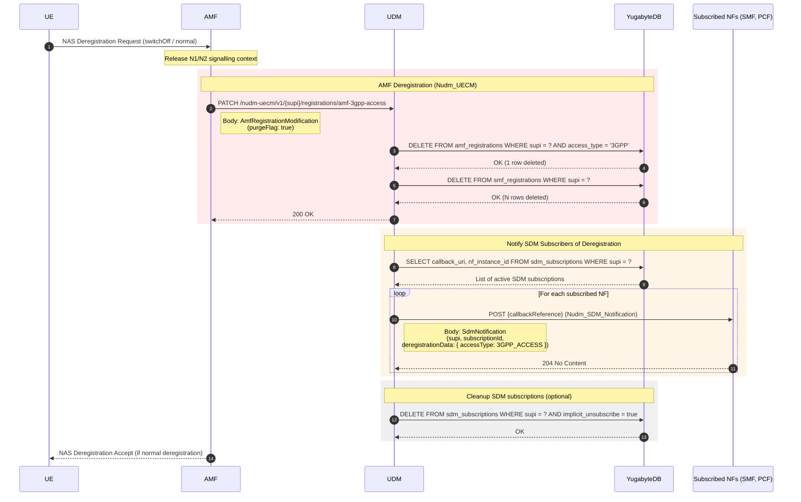

### 7.3 UDM Internal Processing Notes

- **Purge Flag**: When `purgeFlag=true`, the UDM removes all registration contexts for the subscriber. This differs from a simple context update.
- **Cascading Cleanup**: SMF registrations are also removed since PDU sessions are implicitly released on deregistration.
- **Notification Fan-out**: The UDM iterates through all SDM subscriptions and sends callbacks asynchronously. Failed callbacks are retried up to 3 times with exponential backoff.

### 7.4 Error Handling

| Step | Error Condition | UDM Behaviour |
|------|----------------|---------------|
| Deregistration | SUPI not registered | 404 Not Found — `CONTEXT_NOT_FOUND` |
| Deregistration | Wrong AMF (not the registered one) | 403 Forbidden — `NOT_AUTHORIZED` |
| Notification | Callback delivery failure | Retry with exponential backoff; remove subscription after max retries |

---

## 8. Subscription Data Update Notification Flow

### 8.1 Description

When an operator modifies subscriber data (via O&M, provisioning API, or BSS), the UDM detects the change and notifies all NFs that have active SDM subscriptions for the affected data sets.

**3GPP Reference**: TS 29.503 (Nudm_SDM Notification), TS 29.505

### 8.2 Sequence Diagram

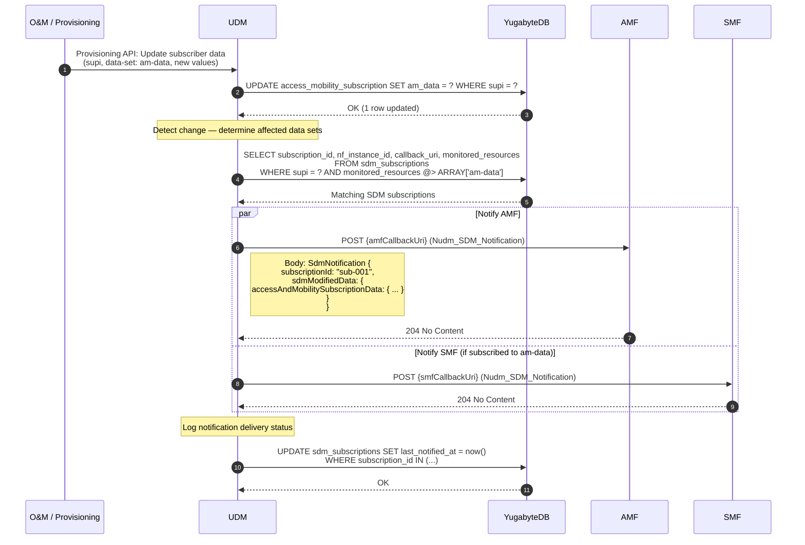

### 8.3 UDM Internal Processing Notes

- **Change Detection**: The provisioning API path triggers notification evaluation inline. The UDM compares monitored resource URIs in each SDM subscription against the changed data set.
- **Notification Content**: The SDM notification can include the full modified data or only a change indicator, depending on the subscription's `immediateReport` flag.
- **Concurrency**: Notifications to multiple NFs are sent in parallel using goroutines with a bounded worker pool.

### 8.4 Error Handling

| Step | Error Condition | UDM Behaviour |
|------|----------------|---------------|
| Data Update | Invalid data format | 400 Bad Request from provisioning API |
| Subscription Lookup | No matching subscriptions | No notifications sent; update completes silently |
| Notification Delivery | NF unreachable (timeout) | Retry 3 times with backoff; mark subscription as stale after final failure |
| Notification Delivery | NF returns 410 Gone | Remove SDM subscription from DB |

---

## 9. SMS Registration Flow

### 9.1 Description

The SMSF registers with the UDM when it starts serving a UE for SMS over NAS. The UDM stores the SMSF context alongside the existing AMF registration.

**3GPP Reference**: TS 23.502 Section 4.13.3, TS 29.503 (Nudm_UECM)

### 9.2 Sequence Diagram

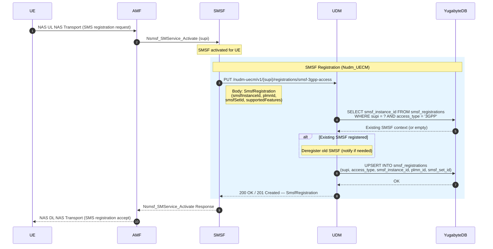

### 9.3 UDM Internal Processing Notes

- **SMSF Context Table**: The `smsf_registrations` table is keyed by `(supi, access_type)` — one SMSF per access type (3GPP or non-3GPP) per subscriber.
- **Old SMSF Handling**: If a different SMSF was previously registered, the UDM may send a deregistration notification to the old SMSF before overwriting.

### 9.4 Error Handling

| Step | Error Condition | UDM Behaviour |
|------|----------------|---------------|
| Registration | SUPI not found | 404 Not Found |
| Registration | SMS service not in subscription | 403 Forbidden — `SMS_NOT_ALLOWED` |

---

## 10. Event Exposure Subscription Flow

### 10.1 Description

NFs (typically NEF or AF via NEF) subscribe to UDM event exposure to receive real-time notifications about subscriber events such as registration state changes, location updates, or data change events.

**3GPP Reference**: TS 29.503 (Nudm_EE), TS 23.502 Section 4.15.1

### 10.2 Sequence Diagram

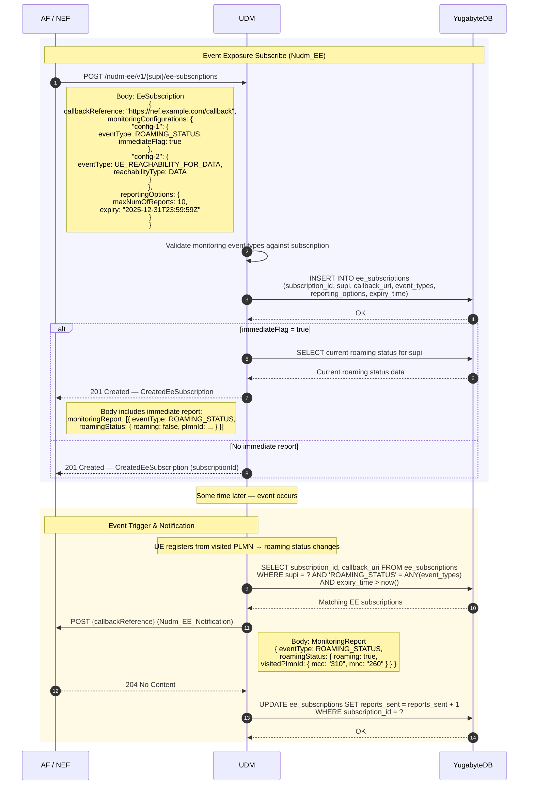

### 10.3 UDM Internal Processing Notes

- **Supported Event Types**: ROAMING_STATUS, UE_REACHABILITY_FOR_DATA, LOSS_OF_CONNECTIVITY, LOCATION_REPORTING, CHANGE_OF_SUPI_PEI_ASSOCIATION, and others per TS 29.503.
- **Expiry Management**: A background goroutine periodically scans for expired EE subscriptions and removes them from YugabyteDB.
- **Rate Limiting**: The `maxNumOfReports` field caps how many notifications a subscription can generate before auto-removal.

### 10.4 Error Handling

| Step | Error Condition | UDM Behaviour |
|------|----------------|---------------|
| Subscribe | Unsupported event type | 400 Bad Request — `UNSUPPORTED_EVENT_TYPE` |
| Subscribe | SUPI not found | 404 Not Found |
| Notification | Callback failure | Retry with backoff; remove subscription on repeated failures |
| Expiry | Subscription expired | Auto-delete from DB; no further notifications |

---

## 11. Roaming Scenario

### 11.1 Description

In roaming scenarios, the visited network's AMF (vAMF) communicates with the home UDM through Security Edge Protection Proxies (SEPPs). The UDM handles both **home-routed** and **local breakout** PDU session models.

**3GPP Reference**: TS 23.502 Section 4.2.2.2 (roaming), TS 29.503, TS 33.501 Section 6

### 11.2 Sequence Diagram — Home-Routed

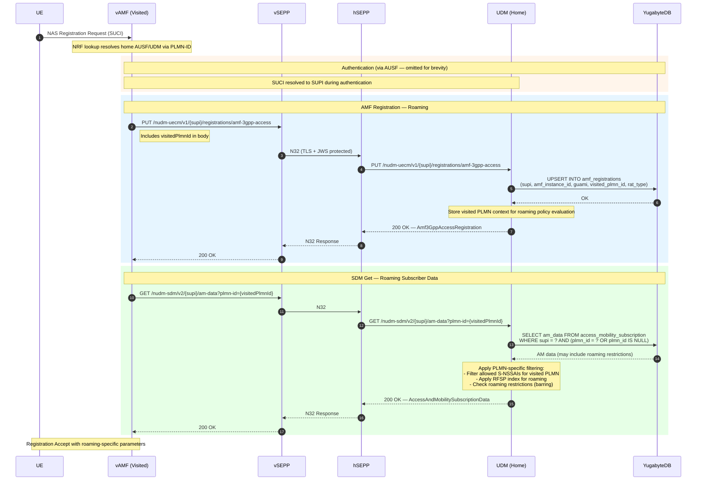

### 11.3 Sequence Diagram — Local Breakout

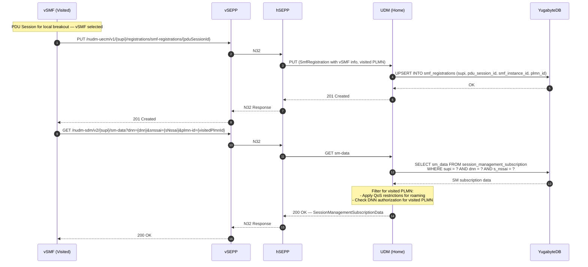

### 11.4 UDM Internal Processing Notes

- **PLMN-Specific Data**: The UDM stores per-PLMN overrides for AM and SM data. When a visited PLMN-ID is provided, the UDM applies PLMN-specific policies (restricted S-NSSAI, QoS adjustments).
- **SEPP Transparency**: The SEPP is transparent to the UDM — the UDM processes requests identically regardless of whether they arrive from a local NF or via SEPP.
- **Roaming Steering**: The UDM may include Steering of Roaming (SoR) information in the AM data response to redirect UEs to preferred visited PLMNs.

### 11.5 Error Handling

| Step | Error Condition | UDM Behaviour |
|------|----------------|---------------|
| AMF Registration | Visited PLMN not allowed for roaming | 403 Forbidden — `ROAMING_NOT_ALLOWED` |
| SDM Get | DNN not authorized for visited PLMN | 403 Forbidden — `DNN_NOT_ALLOWED_FOR_VISITED_PLMN` |
| SDM Get | S-NSSAI not available in visited PLMN | Return filtered list excluding unavailable slices |

---

## 12. Network Slicing Data Retrieval

### 12.1 Description

The AMF retrieves the subscriber's subscribed S-NSSAIs from the UDM to determine which network slices the UE is authorized to use. This data drives Network Slice Selection Assistance Information (NSSAI) sent to the UE.

**3GPP Reference**: TS 23.502 Section 4.2.2.2 (step 14), TS 29.503 (Nudm_SDM), TS 23.501 Section 5.15

### 12.2 Sequence Diagram

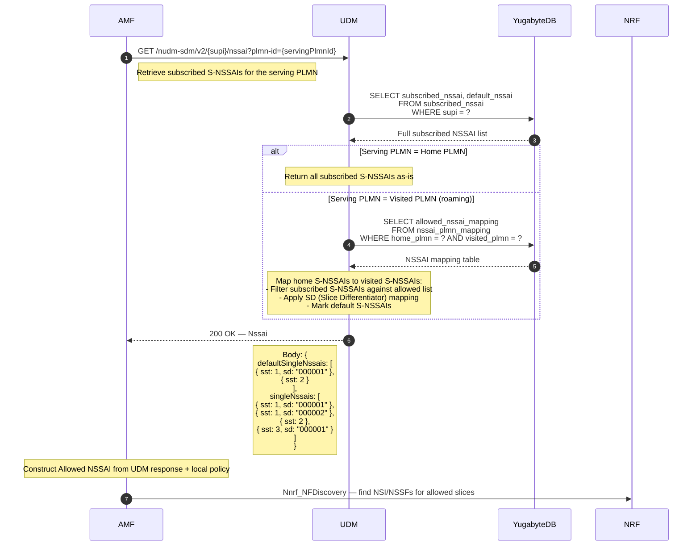

### 12.3 UDM Internal Processing Notes

- **NSSAI Table Structure**: The `subscribed_nssai` table stores per-subscriber slice authorizations with columns for SST (Slice/Service Type) and SD (Slice Differentiator).
- **PLMN Mapping**: For roaming, the `nssai_plmn_mapping` table translates home PLMN S-NSSAIs to equivalent visited PLMN S-NSSAIs.
- **Default S-NSSAIs**: A subset of subscribed S-NSSAIs are marked as default and are included in every Registration Accept.

### 12.4 Error Handling

| Step | Error Condition | UDM Behaviour |
|------|----------------|---------------|
| NSSAI Get | SUPI not found | 404 Not Found |
| NSSAI Get | No subscribed NSSAI for PLMN | 200 OK with empty `singleNssais` array |
| PLMN Mapping | No mapping exists for visited PLMN | Return only S-NSSAIs with SST values common to both PLMNs |

---

## 13. State Machine Diagrams

### 13.1 UE Registration State Machine

Tracks the UE's registration lifecycle from the UDM's perspective.

**3GPP Reference**: TS 23.502 Section 4.2.2

```
                    ┌─────────────────────┐
                    │                     │
            ┌───────│    DEREGISTERED     │◄──────────────────┐
            │       │                     │                   │
            │       └─────────────────────┘                   │
            │                  │                              │
            │    Nudm_UECM_Registration                      │
            │    (PUT amf-3gpp-access)                        │
            │                  │                              │
            │                  ▼                              │
            │       ┌─────────────────────┐        Nudm_UECM_Deregistration
            │       │                     │        (PATCH purgeFlag=true)
            │       │    REGISTERED       │───────────────────┘
            │       │                     │
            │       └─────────────────────┘
            │                  │
            │    Nudm_UECM_Registration
            │    (PUT from different AMF)
            │                  │
            │                  ▼
            │       ┌─────────────────────┐
            │       │  REGISTERED         │
            └───────│  (context updated,  │
                    │   old AMF notified) │
                    └─────────────────────┘

    States:
    ─────────────────────────────────────────────────────
    DEREGISTERED     No AMF context stored for SUPI.
                     UDM has no serving AMF information.

    REGISTERED       AMF context stored. UDM knows which
                     AMF is serving the UE, the GUAMI,
                     RAT type, and UE capabilities.
```

### 13.2 AMF Context State Machine

Tracks the AMF registration context lifecycle within the UDM.

```
    ┌──────────┐   PUT amf-3gpp-access   ┌──────────────┐
    │          │ ────────────────────────► │              │
    │  EMPTY   │                          │   ACTIVE     │
    │          │ ◄──────────────────────── │              │
    └──────────┘   PATCH purgeFlag=true   └──────────────┘
                   or TTL expiry                │    ▲
                                                │    │
                                     PUT from   │    │  Context
                                     new AMF    │    │  replaced
                                                ▼    │
                                          ┌──────────────┐
                                          │   ACTIVE     │
                                          │ (new AMF)    │
                                          └──────────────┘

    Transitions:
    ─────────────────────────────────────────────────────────────
    EMPTY → ACTIVE        First AMF registration for SUPI.
                          Triggered by Nudm_UECM_Registration.

    ACTIVE → ACTIVE       AMF re-registration or handover to
    (context replaced)    new AMF. Old AMF notified via
                          Namf_Communication callback.

    ACTIVE → EMPTY        Explicit deregistration (purge) or
                          implicit TTL-based expiry.
```

### 13.3 Authentication State Machine

Tracks the authentication lifecycle per SUPI.

```
    ┌──────────────┐
    │              │
    │    IDLE      │ ◄─────────────────────────────────┐
    │              │                                    │
    └──────────────┘                                    │
           │                                            │
           │  Nudm_UEAU_GenerateAuthData                │
           │  (POST generate-auth-data)                 │
           │                                            │
           ▼                                            │
    ┌──────────────┐                                    │
    │  AV_ISSUED   │                                    │
    │              │────── Timeout (no confirmation) ───┘
    │  (awaiting   │
    │   result)    │
    └──────────────┘
           │
           │  Nudm_UEAU_ResultConfirmation
           │  (POST auth-events)
           │
           ├────────────── success ──────────────┐
           │                                     │
           ▼                                     ▼
    ┌──────────────┐                   ┌──────────────┐
    │ AUTH_FAILED  │                   │ AUTH_SUCCESS  │
    │              │──── retry ───►    │              │──── next reg ───► IDLE
    └──────────────┘   (new AV)       └──────────────┘
                         │
                         ▼
                  Back to IDLE
                  (new generate-auth-data)

    States:
    ──────────────────────────────────────────────────────
    IDLE              No pending authentication for SUPI.

    AV_ISSUED         Auth vector generated and sent to
                      AUSF. SQN incremented. Awaiting
                      result confirmation.

    AUTH_SUCCESS      Authentication confirmed successful.
                      Auth event logged. Transitions back
                      to IDLE for next registration.

    AUTH_FAILED       Authentication failed. Auth event
                      logged with failure reason. May
                      trigger retry or lockout policy.
```

---

## 14. Common Error Handling

### 14.1 Standard Error Response Format

All Nudm services return errors in the 3GPP ProblemDetails format per TS 29.500:

```json
{
  "type": "https://example.com/errors/subscription-not-found",
  "title": "Subscription Not Found",
  "status": 404,
  "detail": "No subscription data found for SUPI imsi-001010123456789",
  "instance": "/nudm-sdm/v2/imsi-001010123456789/am-data",
  "cause": "SUBSCRIPTION_NOT_FOUND"
}
```

### 14.2 Retry and Timeout Strategy

```
    Request ──► UDM ──► YugabyteDB
                 │
                 ├── DB timeout (>500ms) ──► Retry once on different tablet
                 │
                 ├── DB unavailable ──► 503 Service Unavailable
                 │                      (Retry-After: 5)
                 │
                 ├── NF callback timeout ──► Async retry (3 attempts)
                 │                           Exponential backoff: 1s, 2s, 4s
                 │
                 └── Request validation fail ──► 400 Bad Request (no retry)
```

### 14.3 Common Error Codes

| HTTP Status | 3GPP Cause | Applicable Services | Description |
|-------------|-----------|---------------------|-------------|
| 400 | `INVALID_QUERY_PARAM` | SDM, UECM, EE | Malformed request parameters |
| 403 | `ROAMING_NOT_ALLOWED` | UECM, SDM | Subscriber barred from roaming |
| 404 | `USER_NOT_FOUND` | All | SUPI not provisioned |
| 404 | `CONTEXT_NOT_FOUND` | UECM | No registration context for SUPI |
| 409 | `CONTEXT_CONFLICT` | UECM | Registration context conflict |
| 429 | `TOO_MANY_REQUESTS` | All | Rate limit exceeded |
| 500 | `SYSTEM_FAILURE` | All | Internal error (DB failure, crypto error) |
| 503 | `SERVICE_UNAVAILABLE` | All | Temporary overload or DB unreachable |

---

*End of document. For API-level details, see [sbi-api-design.md](sbi-api-design.md). For data model schemas, see [data-model.md](data-model.md).*
